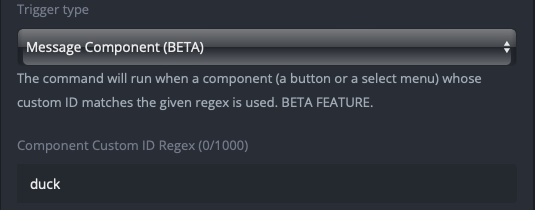
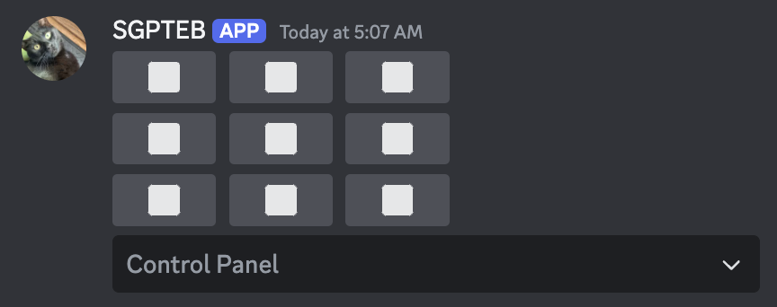

+++
title = 'Custom Interactions'
weight = 6
+++

Buttons, Modals, Select Menus, Ephemeral Messages, and more!

<!--more-->

{}

Use of interactions within YAGPDB is an advanced topic. You will need a thorough understanding of YAGPDB's scripting
language before learning interactions.

We have a comprehensive learning course located [here](https://learn.yagpdb.xyz) for you to get started.

{}

## The Basics

Interactions within Discord allow server members to use alternative, built-in features to trigger bots to take action
other than messages or reactions. These features include builtin buttons, dropdown selection menus, or submitting a
modal (basically a pop-up form). Within custom commands it is possible to both create and customize these new
interactive features, but respond to them as well, opening up new possibilities for ephemeral message responses, modals,
and more within YAGPDB custom templating script.

### Definitions

**Interaction** - A user engaging with YAGPDB through one of Discord's builtin features: Clicking a button, Making a
selection with a select menu, or Submitting a modal.

**Response** - YAGPDB is required to send an initial interaction response after receiving an *interaction*. If it does
not do this, the user triggering the interaction will see a "This application did not respond" error. The bot cannot
respond to an interaction more than once. YAGPDB may only respond to an interaction in one of the following ways:
Sending a message, sending a modal, or updating the message which the *interaction* was triggered on.

**Followup** - Since YAGPDB may only *respond* to an *interaction* once, it is subsequently required to send an interaction
followup if it still needs to respond to the interaction. These followups can be sent up to 15 minutes after the initial
interaction, and you can send as many as you want. YAGPDB may only send a followup in one of the following ways: Sending
a message, editing a response or followup, or getting a response or followup message.

**Interactive Elements** - Elements users can interact with to send *interactions*, i.e. buttons, menus, and modals.

**Message Components** - *Interactive Elements* which can be attached to YAGPDB's Discord messages, i.e. buttons and menus.

**Button** - A button appearing in or under a Discord message sent by YAGPDB. You can create and customize these
buttons' appearance and behavior with color, emoji, label text, etc. When a button is clicked, an *interaction* is sent
to the bot.

**Menu** - A dropdown select menu appearing in or under a Discord message sent by YAGPDB. You can create and customize these
menus' appearance and behavior with placeholder text, predefined options with labels, descriptions, and/or emojis,
designate the entire menu as a user or role select menu instead, etc. When a select menu is used, an *interaction* is sent
to the bot.

**Modal** - A pop-up form YAGPDB can send in response to an interaction. It allows users to privately input text which
is sent directly to YAGPDB for use in CC scripting. You can create and customize these modals' appearance and
behavior with a title and fields. YAGPDB can both **receive a submitted modal** (which is an
*interaction*), and **send a modal** for a member to fill out, (which is an interaction *response*).

**Ephemeral** - An ephemeral message is sent to a server channel but only appears to a single user. YAGPDB cannot send
these ephemeral messages to users except in response to an *interaction*. Both *response* messages and *followup*
messages can be ephemeral.

## Interaction Lifetime

An interaction's lifetime starts with the initial *interaction* with an *interactive element*.

1. A server member clicks on a *button*, uses a *menu*, or submits a *modal* after filling it out.
2. This interaction is sent to YAGPDB, and becomes available to trigger any custom commands which match it.
3. Within the triggered custom command(s), YAGPDB should then *respond* once to the interaction, sending a message,
   updating the triggering message, or sending a modal. This may only be done within the CC which was triggered by the
   interaction.
4. _(optional)_ Continue to send followup responses for up to 15 minutes until the interaction token expires.


graph LR;
    A[Button pressed] --> B{CC Triggered}
    C[Menu used] --> B
    D[Modal submitted] --> B
    B --> E[Bot sends message response]
    B --> G[Bot sends modal response]
    B --> H[Bot updates message]
    E --> F(Bot sends followups)
    G --> F
    H --> F


## Creating Interactive Elements

Before you can start triggering Custom Commands with interactive elements, you'll need to have elements to interact
with. *Message Components* can be created and sent with `complexMessage` and `sendMessage`. *Modals* need a triggering
*interaction* to be sent, meaning you'll only be able to show a modal after a user has used a message component.

### Creating Message Components

#### Basics

Let's examine how to make a basic button.

```go
{{ $button := cbutton "label" "Button" }}
{{ $message := complexMessage "buttons" $button }}
{{ sendMessage nil $message }}
```


We've successfully made a basic button. Currently this button doesn't do anything when we click it. That's because it
doesn't have an ID that YAGPDB can use to trigger any other custom commands. For our next iteration, we'll add a custom
ID which can trigger a custom command. Let's say we want to trigger a custom command with this trigger:



This custom command will trigger on any message component, either button or menu, whose custom ID contains the word "duck."

```go
{{ $button := cbutton "label" "Button" "custom_id" "buttons-duck" }}
{{ $message := complexMessage "buttons" $button }}
{{ sendMessage nil $message }}
```

This button triggers our duck RegEx custom command.

Now, let's add some more buttons.

{}

You cannot have two message components with the same Custom ID in one message.

{}

{}

Buttons with the "link" style cannot have a Custom ID, and instead require a URL field.

Link style buttons do not trigger *interactions*.

{}

```go
{{ $button1 := cbutton "label" "Duck One" "custom_id" "buttons-duck-alpha" "style" "success" }}
{{ $button2 := cbutton "emoji" (sdict "name" "🦆") "custom_id" "buttons-duck-beta" "style" "danger" }}
{{ $button3 := cbutton "label" "Duck Three" "emoji" (sdict "name" "🦆") "url" "https://yagpdb.xyz" "style" "link" }}
{{ $message := complexMessage "buttons" (cslice $button1 $button2 $button3) }}
{{ sendMessage nil $message }}
```


At this stage we have three buttons. Both of the first two buttons will trigger our duck trigger custom command, but the
third button will not trigger any custom command. Link buttons do not create *interactions*.

We can differentiate between the two buttons with `.StrippedID`, which returns the `.CustomID` but with the trigger and
everything before it (in our case, `buttons-duck`) stripped off.

Let's add in a select menu now.

```go
{{ $button1 := cbutton "label" "Duck One" "custom_id" "buttons-duck-alpha" "style" "success" }}
{{ $button2 := cbutton "emoji" (sdict "name" "🦆") "custom_id" "buttons-duck-beta" "style" "danger" }}
{{ $button3 := cbutton "label" "Duck Three" "emoji" (sdict "name" "🦆") "url" "https://yagpdb.xyz" "style" "link" }}

{{ $menu := cmenu
  "type" "text"
  "placeholder" "Choose a terrible thing"
  "custom_id" "menus-duck-alpha"
  "options" (cslice
    (sdict "label" "Ducks" "value" "opt-1" "default" true)
    (sdict "label" "Duck" "value" "opt-2" "emoji" (sdict "name" "🦆"))
    (sdict "label" "Half a Duck" "value" "opt-3" "description" "Don't let the smaller amount fool you."))
  "max_values" 3 }}

{{ $message := complexMessage "buttons" (cslice $button1 $button2 $button3) "menus" $menu }}
{{ sendMessage nil $message }}
```


We now have two buttons and a menu which are triggering our duck custom command. We used to branch with `.StrippedID`,
but now since we have two components whose stripped IDs are `-alpha`, we'll need to branch with `.IsMenu` too. If our
custom command was triggered by the use of this select menu, we could also see that `.MenuType` returns `"string"`,
since this menu is a string select type menu.

##### Ordering Message Components

A message can have 5 rows of components.
A row of components can have 5 buttons, **or** 1 menu.

Let's say I wanted to play tic tac toe. If I just add 9 buttons into the same slice in my complex message, they'll just
fill the first row with 5 buttons and the second row with 4, which isn't what I'm looking for. Here's a solution:

```go
{{ $blankEmoji := sdict "name" "⬜" }}

{{ $row1 := cslice (cbutton "emoji" $blankEmoji "custom_id" "tictactoe-button-1" "style" "secondary") (cbutton "emoji" $blankEmoji "custom_id" "tictactoe-button-2" "style" "secondary") (cbutton "emoji" $blankEmoji "custom_id" "tictactoe-button-3" "style" "secondary") }}
{{ $row2 := cslice (cbutton "emoji" $blankEmoji "custom_id" "tictactoe-button-4" "style" "secondary") (cbutton "emoji" $blankEmoji "custom_id" "tictactoe-button-5" "style" "secondary") (cbutton "emoji" $blankEmoji "custom_id" "tictactoe-button-6" "style" "secondary") }}
{{ $row3 := cslice (cbutton "emoji" $blankEmoji "custom_id" "tictactoe-button-7" "style" "secondary") (cbutton "emoji" $blankEmoji "custom_id" "tictactoe-button-8" "style" "secondary") (cbutton "emoji" $blankEmoji "custom_id" "tictactoe-button-9" "style" "secondary") }}

{{ $menu := cmenu
  "type" "text"
  "placeholder" "Control Panel"
  "custom_id" "tictactoe-menu"
  "options" (cslice
    (sdict "label" "Forfeit" "value" "forfeit")
    (sdict "label" "Toggle Notifications" "value" "notifs"))}}

{{ $message := complexMessage "buttons" $row1 "buttons" $row2 "buttons" $row3 "menus" $menu }}
{{ sendMessage nil $message }}
```



#### Advanced

### Creating Modals

## Parsing an Interaction

## Responding to an Interaction

## Following Up
